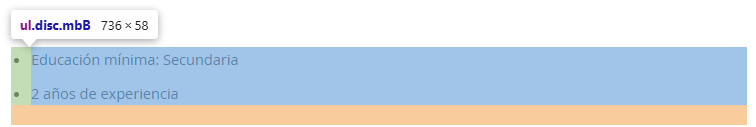

# Estructura del repositorio
- bbdd: 
  - backup: 
- 
# Cómo correr el código

## Configuración inicial
### Requirements
Instalar todas las dependencias presentes en `requirements.txt`

### .env (Tecoloco)
Asegurarse de tener completo el archivo `.env` - sirve para configurar el comportamiento del scraper de Tecoloco, no afecta al de CompuTrabajo
Variables relevantes:
* **BASE_URL**: www.tecoloco.com - es un seteo genérico, no se recomienda variarlo
* **RESULTS_PER_PAGE**: por defecto está seteado en 100 pero se puede poner otro número, no debería variar demasiado el funcionamiento del scraper - no se recomienda un valor superior
* **HEADER_BASE**: es el header del primer request que se hace desde el navegador a tecoloco.com - se obtiene siguiendo los pasos del Screenshot
    1. Abrir la consola de desarrollador del navegador
    2. Ir a la sección Red
    3. Abrir `tecoloco.com`
    4. Buscar el primer request (como se muestra en la imagen)
    5. Click derecho -> Copiar -> Copiar como cURL (cmd)
    6. Tomar el valor del parámetro -H del comando en .env cuidando el formato dado

## Descarga CompuTrabajo
1. Posicionarse desde la terminal dentro de la carpeta `scrapers/computrabajo`
2. Correr `python app.py`
3. Listo! Los crudos se pueden encontrar en la carpeta `bbdd`

## Descarga Tecoloco
1. Posicionarse desde la terminal dentro de la carpeta `scrapers/tecoloco`
2. Correr `python main_links.py` y esperar a que finalice
4. Correr `python main_contents.py`
5. Listo! Los crudos se pueden encontrar en la carpeta `bbdd`

# Mantenimiento de scrapers

## Computrabajo
### Headers
* Siguiendo el mismo procedimiento que para el archivo `.env` de Tecoloco, se puede tener que actualizar la información del header dentro de `scrapers/computrabajo/constantes.json`

### Clases identificadoras de secciones
* En la consola de desarrollador (F12 en Chrome) se puede ver el detalle de los elementos de la web en HTML. Para identificar determinadas secciones se utiliza la clase (class) asignada, y puede variar. En caso que varíe es fácilmente identificable como se muestra en los screenshots adjuntos debajo. En este caso la clase es `disc mdB` y corresponde a la constante `requisitos` dentro de `constantes.json`, en el ítem `CLASES`.

# Transformación
Correr el archivo `main_transformacion.py`, que va a crear un archivo llamado `trablafinal.xlsx` con todos los datos transformados y formateados